# Java on Azure Devops 
This repository demonstrates a Java microservice project deployed on Azure DevOps, highlighting CI/CD pipeline stages, automated testing, and infrastructure provisioning. The application, "BooksService," features RESTful APIs for adding and retrieving books, and is deployed to Azure App Services for two environments: Dev and QA.
The CI/CD pipeline integrates Maven builds, unit testing, acceptance tests, and deployment with approval gates for QA. It also includes advanced capabilities such as Newman payload testing, JMeter-based load testing with Azure Load Testing, and code analysis using Microsoft Defender for DevOps. Infrastructure is provisioned using Bicep templates for automated deployment.
## Prerequisites
  - Azure Subscription
  - Azure Devops Organisation
  - [Azure resource Manager service connection](https://azuredevopslabs.com/labs/devopsserver/azureserviceprincipal)

## The Java Microservice:
  - Books service with 2 endpoints:
    - POST : `/books/add`
      - body :
    
        ```json
        {'title' : 'string',
         'author': 'string' }
        ```
    - GET: `/books/{id}`
      - id (path parameter) : `Long`
  - JDK Version : 11
  - Spring boot version : 2.7.4
  


## CI/CD  :
The CI/CD pipeline contains 3 stages : <br>

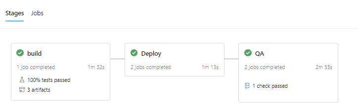

  - Stage Build 
    - maven build
    - publishing azure artifacts (.jar) to pipeline staging directory
    - Code Analysis using #Microsoft Defender for Devops 
  - Deploy to Dev
    - Deploy to dev app service
    - Run newman test
  - Deploy to QA
    - Asking for environment Approval
    - Deploying to Qa app service
    - Run Azure load testing
  
### Requiring an approval to deploy to QA
 - To require an approval you need a pipeline environment, here are the steps to do so:
   - Create an empty environment, [see example](https://learn.microsoft.com/en-us/azure/devops/pipelines/process/environments?view=azure-devops)
    - In the more options menu, choose approvals and checks <br>
  
      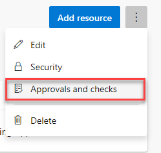

    - Create new approval, and add approvers from your organisation
  
      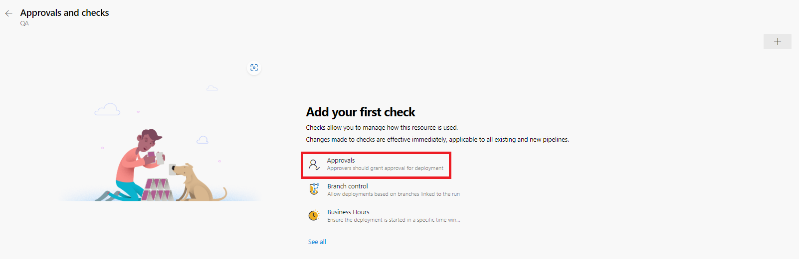<br>

   - Include the environment in the desired stage 
 - 
      ```yaml
      - stage: QA
        jobs:
          - deployment: DeployQA
            environment: 'QA'
            strategy:
            runOnce:
              deploy:  
                steps:
                ...
      ```
    - When the pipeline reaches the QA stage, it will wait for approval <br>
      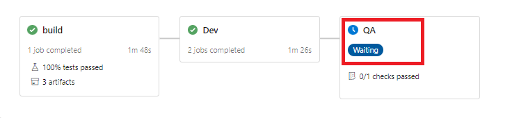 <br>
   - There are more checks that can be implemented, for more informations see [More Informations on checks](https://learn.microsoft.com/en-us/azure/devops/pipelines/process/approvals?view=azure-devops&tabs=check-pass)

## Automated testing :
### Unit Tests: junit
The jUnit test are run during the maven package task
- Test results are published in the test summary<br>
  
  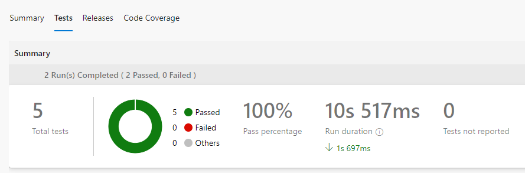

- Jacoco code coverage analysis is performed during the maven package task and  results are published in the code coverage tab
  
  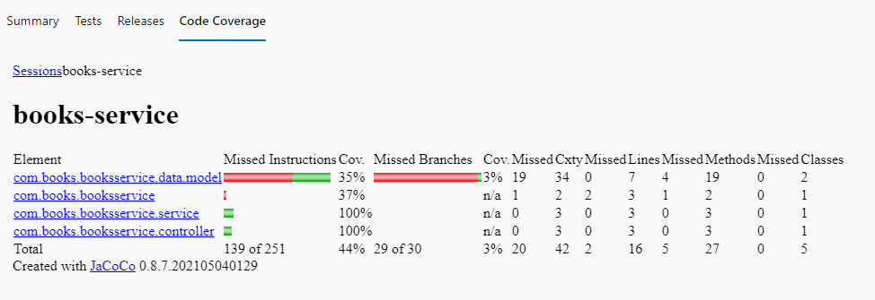

### Acceptance tests: Cucumber  
- Cucumber tests are run during maven package task, the results are published in the PublishTestResults Task
  ```yaml
      - task: PublishTestResults@2
        inputs:
          testResultsFormat: 'JUnit'
          testResultsFiles: '**/cucumber-reports/*.xml'
          testRunTitle: 'Acceptance-Tests' 
          ...     
  ```
  You can see the Acceptance tests reports in the test runs section of Azure Devops <br>

  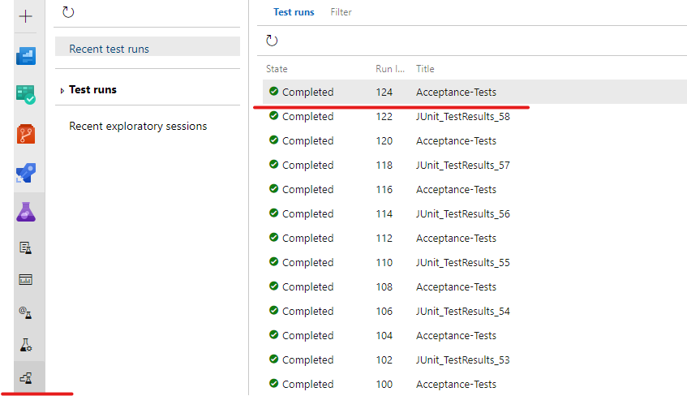<br>

  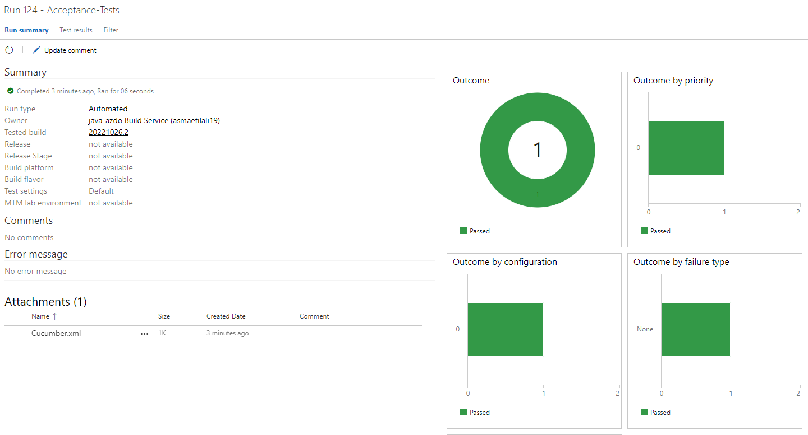     
  
### Payload Tests : newMan 
- The Newman collection is located in newman/booksTest.postman_collection, newman tests are run in the build stage withe the task CmdLine@2 which executes the newman run command in  a commandLine script :

  ```yaml
      - task: CmdLine@2
        inputs:
          script: |
            npm install -g newman  --loglevel=error
            newman run booksTest.postman_collection.json  --env-var url=https://<app-service-name>.azurewebsites.net
          workingDirectory: '$(System.DefaultWorkingDirectory)/newman'
          ...     
  ```
- The commandLine takes as a environnement variable the deployed dev app service url <br>
  
  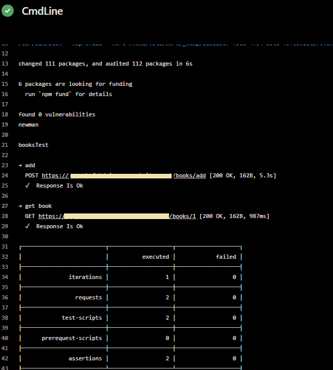

- If you want to publish newman reports to Azure Devops there many opensource extensions to visualise the html reports, so be selective ;)  

### Load Testing : Azure Load Test
- The Load testing is done within Azure LoadTesting Task, which uses Jmeter Load testing, the Jmeter files are located under /jmeter folder, the contains 2 files:
  -  jmeter.yaml :  contains the configuration for the load test and the failure criteria
  -  jmeterTest.xml : contains the load test scenario, the number of request per second, test duration ..
- The Load testing  is run in the QA with AzureLoadTest@1, this task has 2 requirements :
  -  The [azure load testing extention](https://marketplace.visualstudio.com/items?itemName=AzloadTest.AzloadTesting) to be installed in your Azure DevOps organisation
  -  An azure load test resource which can be created via azure portal<br>
  
  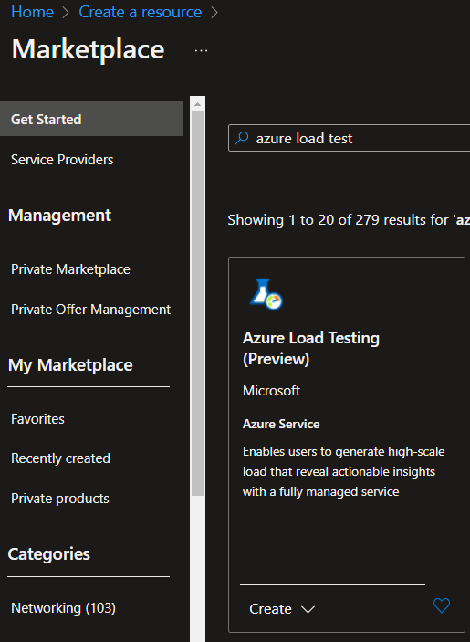<br> 

- The task AzureLoadTest@1 which is configured as following :
   
     ```yaml
      - task: AzureLoadTest@1
        inputs:
          azureSubscription: '<service connection name>'
          loadTestConfigFile: '$(System.DefaultWorkingDirectory)/jmetter/jmeter.yaml'
          resourceGroup: '<load test resource group>'
          loadTestResource: '<load test resource name>'
      ``` 
- The succeeds or fails according to failure criteria specified in jmeter.yaml, in the task logs we can see the results of load test and the link of the load test in azure portal
  
  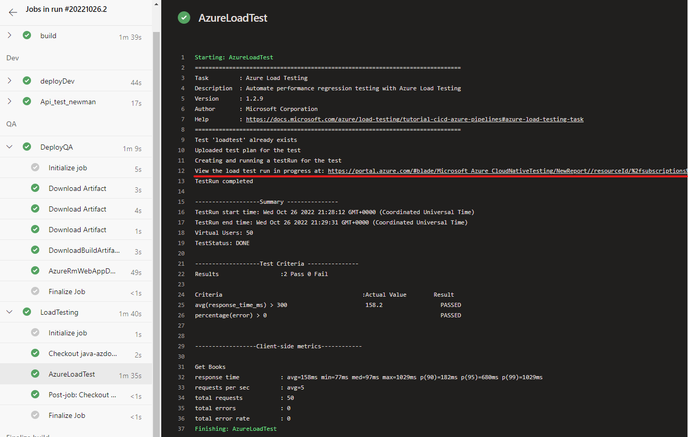 <br>

- The Load test report in azure portal gives analysis of the load test <br>
  
  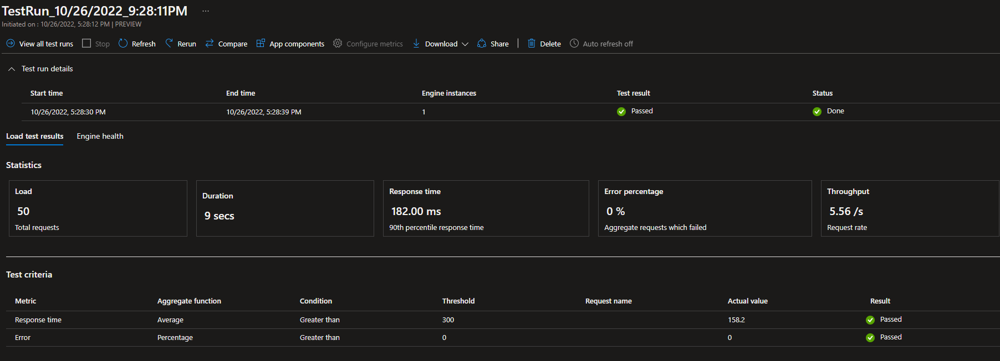  <br>

  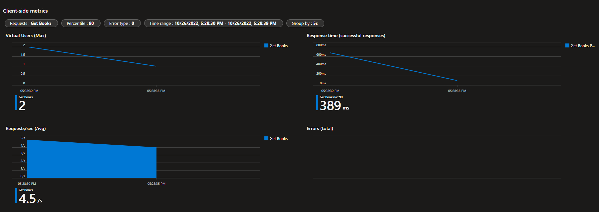  <br>

### Code Analysis 
- Code analysis is done through MicrosoftSecurityDevOps@1, this task requires [Microsoft Security DevOps for Azure DevOps
](https://marketplace.visualstudio.com/items?itemName=ms-securitydevops.microsoft-security-devops-azdevops) to be installed. the task is added to the build stage as following :

     ```yaml
    - task: MicrosoftSecurityDevOps@1
      displayName: 'Microsoft security for devops'
  ```

- The code Analysis results are published with every build as following <br>

  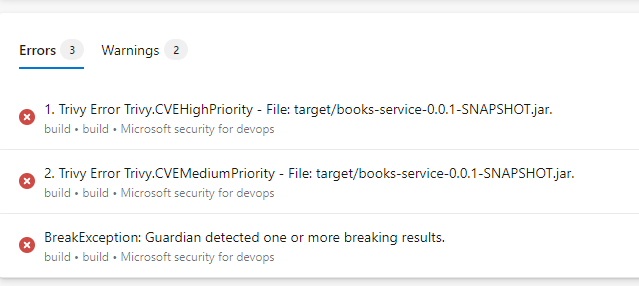

## Infrastructure Provisionning

The infrastrucure is provisionned via the deploy-infra pipeline, which execute a bicep to provision 2 app services.
To execute the pipeline in your environment, you need just to :
- Replace the placeholders for your service connection, subscriptionID in the file ci/deploy-infra.yml
- Replace app service names for QA and dev in the file infra/properties/webappsIAC.json
- Create a new pipeline using the existing yml file file ci/deploy-infra.yml